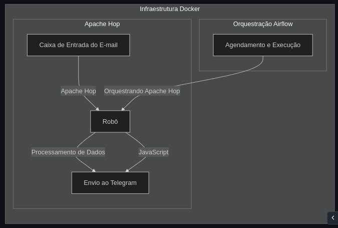

# Projeto - Zero Inadimplência

## Projeto Zero Inadimplência - Em andamento

[Repositório do Projeto](https://github.com/Linhares015/projetos_end_to_end/tree/main/Robo_telegram)

## Descrição

Esse projeto tem como objetivo desenvolver um sistema de controle de inadimplência para uma empresa.

Ele demonstra as habilidades de `desenvolvimento de ETL`, `modelagem de dados`, `desenvolvimento de dashboards` e `desenvolvimento de automações`.

## Solicitação do cliente

O cliente está enfrentando problemas com a inadimplência na sua empresa, e gostaria de ter um controle mais efetivo sobre isso.

Ele não possui nenhum controle sobre a inadimplência, e gostaria de ter um dashboard para poder visualizar os clientes inadimplentes, métricas sobre a inadimplência e sobre a equipe de cobrança.

Ele gostaria também de enviar alertas para a equipe de cobrança, para que eles possam agir rapidamente e evitar que a inadimplência aumente.

Enviar aos clientes, por e-mail, alertas sobre a inadimplência e 5 dias antes das faturas vencerem, para que eles possam regularizar a situação.

## Solução

- Desenvolver um ETL para extrair os dados de inadimplência, transformar e carregar em um banco de dados.

- Desenvolver um dashboard para visualização dos dados com métricas sobre a inadimplência e sobre a equipe de cobrança.

- Desenvolver um robô para enviar alertas para a equipe de cobrança e para os clientes.

## Arquitetura do Projeto

## Tecnologias Utilizadas
- 
- 
- 
- 
- 

## Aulas Youtube
- [Vídeo Parte 1 - Introdução](https://youtu.be/b8FCd9gwoBw)
- [Vídeo Parte 2 - Preparando Ambiente](https://youtu.be/tRxCThPRTKU)
- [Vídeo Parte 3 - Extraindo Excel para o Banco de Dados](https://youtu.be/C9XjXdyVVRQ)
- [Vídeo PArte 4 - Modelagem de dados SQL no Apache Hop](https://youtu.be/vdwLWdIK7fc)
- [Vídeo Parte 5 - Criando Dashboards no Power BI - Parte 1](https://youtu.be/k2m_YbdEIRg)
- [Vídeo Parte 6 - Criando Dashboards no Power BI - Parte 2](https://youtu.be/FNiLGJTI8-I)
